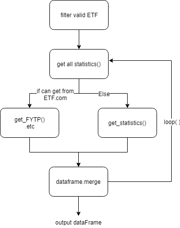
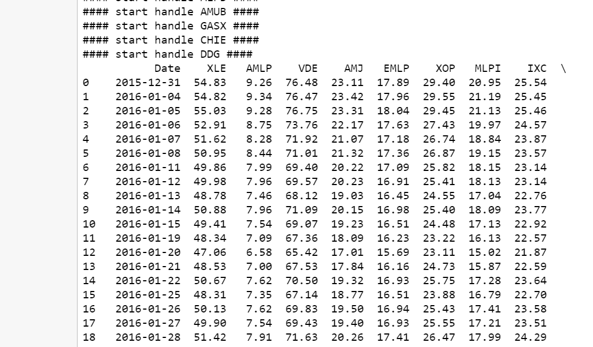
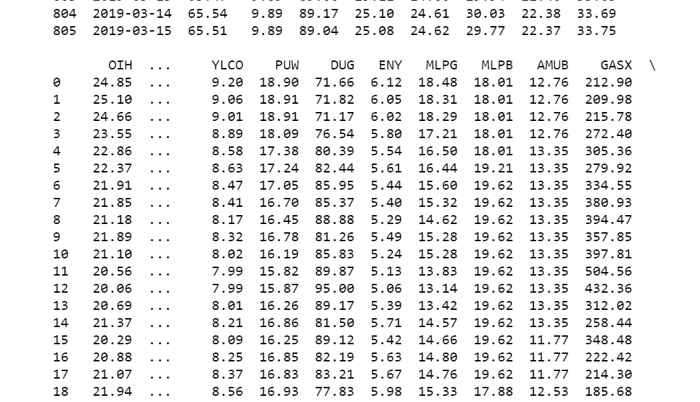
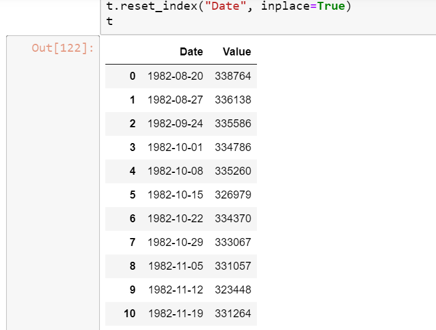

# Hw1 網路爬蟲


- 需安裝以下已執行全部程式

  ```makefile
  pip install numpy
  pip install selenium
  pip install BeautifulSoup4
  pip install lxml
  pip install pandas
  ```

- 使用 `selenium` 是為了使用瀏覽器捲動功能， `Beautifulsoup4` 與 `lxml` 用來解析網頁內容

- 以下範例輸出以 `2019-03-18` 為執行時間

## part 1. ETF 爬蟲

- 檔案名稱：`Crawler.ipynb`

  `

- 從 <https://www.etf.com/> 取得官網後，在官網內能下載每日收盤價的ETF

  - FENY(已下載資料存於`FENY_Price_History_20190315.csv`)
  - TPYP(已下載資料存於`Energy Equity ETF List (80).csv`)

- 無法從其官網取得，或其使用互動是圖表，因為其無法從網頁 source code 內取得，所以使用 <https://finance.yahoo.com/> 作為替代

  - 64 個合法 (2015-12-31 前存在) ETF，請從 `Crawler.ipynb` **cell 2** 的輸出中觀看名單

- 部分內容使用`Selenium.click()`下載 `csv` 檔。已將相關檔案一併附在 hw1 資料夾內，為了方便執行，便將部分下載指令屏蔽，直接開啟本地端檔案。若要實作真實運行狀況，請將相關隱藏程式碼開啟，並從環境變數中將下載路徑改為當前執行資料夾以方便讀檔。

  

  

## part 2. 原油庫存指標

- 檔案名稱：`Crawler (ela.gov).ipynb`

- 從 <https://www.eia.gov/petroleum/supply/weekly/> 取得相關資料
- 與 part 1. 相同，已於資料夾內附上相關 `csv` 檔。



## FAQ

- Q: 我該如何開啟.ipynb檔?

  - A: 下載 jupyter notebook，相關安裝與使用教學請至其官網查詢。

- Q: 我該如何使用爬下來的 dataFrame?

  - A: 可以在 notebook 後面新增一個 cell，使用 pandas 的 method

    ``` python
    df.to_pickle(file_name)  # where to save it, usually as a .pkl
    df = pd.read_pickle(file_name) # load it back, where the filename you save previously 
    ```

  - 可以將 .pkl 檔移到別的資料夾，然後載入使用

- Q: 這份程式有什麼潛在問題可能發生嗎?
  - A: 以下問題發生時，將可能導致程式無法被使用
    - yahoo finance 或 etf.com 網頁發生重大改版
    - 你沒接上網路
- Q: 我能新增新的指標讓程式爬取嗎?
  - A: 理論上，符合 1) yahoo finance有這支 2) 在2015/12/31前存在，你只要將其縮寫(ex: XLE) `.append` 到 `etf_name_list` 內，就能直接爬取。
  - 若不在 yahoo finance上，可以自行補充爬取函式。
- Q: 我能更改爬取的時間範圍嗎?
  - A: 可以。爬取時間目前設在2015/12/31~2019/3/15，可以從 `start_day`和`end_day`調整得到。
  - 調整方式請參考`time.time()`的格式規定。