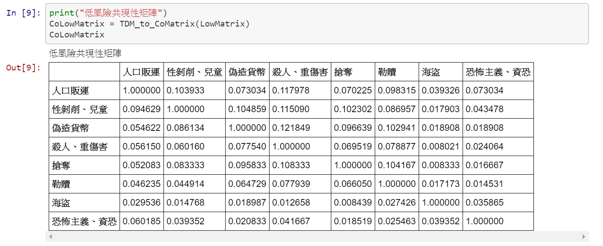
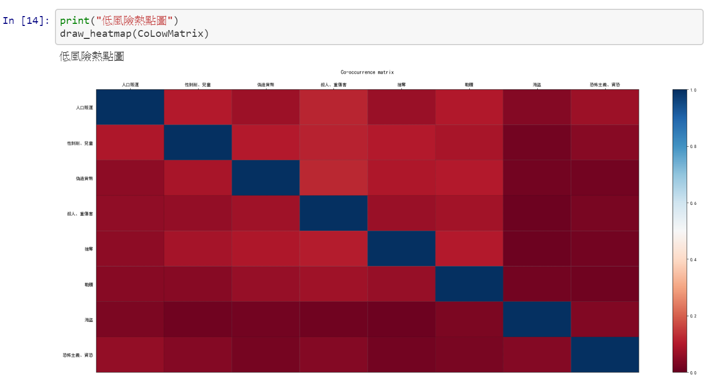
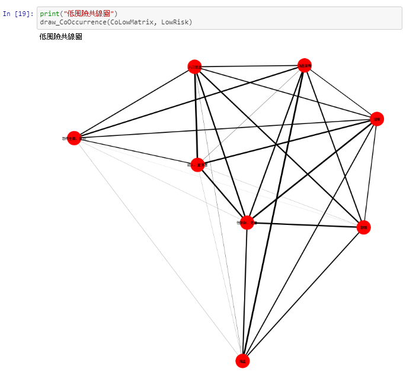

# HW2: 資料蒐集與文字探勘共線性進行資料視覺化

## About Get_PER_data.py
### Pre-install
```bash
pip3 install google
pip3 install git+https://github.com/abenassi/Google-Search-API
pip3 install googletrans
git clone https://github.com/Determined22/zh-NER-TF.git
pip3 install tensorflow
```

### 執行注意事項
- 請將目錄 `zh-NER-TF` 與本py檔放在同個目錄下。
- 請在同個目錄下新建一個目錄 `PER`。
- 執行時會列出一些可用參數 `argv` ，並逐一印出網址及資料筆數。

---
## About my_NER.py (從main.py修改而來)
- 增加/修改的內容：
```python
parser.add_argument('--text', type=str, default='請輸入文本', help='text for demo')
parser.add_argument('--word', type=str, default='請輸入關鍵字', help='text for demo')

while(1): => for i in range(1):

demo_sent = input() => demo_sent = args.text

print('PER: {}\nLOC: {}\nORG: {}'.format(set(list(PER)), LOC, ORG))
=>
with open("../PER/" + args.word +".txt","a",encoding = "utf_16") as tmp:
    tmp.write('PER: {}\n'.format(list(set(PER))))
```

### 備註
- 短時間內執行太多次可能會被google ban掉 `(http error 503: service unavailable)`，此時請更換 IP 位址。
- `page_cnt` 參數(紀錄當前關鍵字的資料筆數)可能會有小誤差。
- 有關 3 個 `try & except` :
	1.  為了讓 `request` 函數可以 `timeout` 並繼續執行。
	2.  防止 `translate` 函數發生錯誤而中止程式。(如翻譯長度過長)
	3.  防止執行 NER 或開檔時發生錯誤而中止程式。

---
## About Make_Co-Occurrence_Matrix.ipynb
### Pre-install
```bash
pip3 install networkx
pip3 install matplotlib
```

### Demo

- 共線性矩陣
  - 

- 熱點圖與共線圖
  - 
  - 